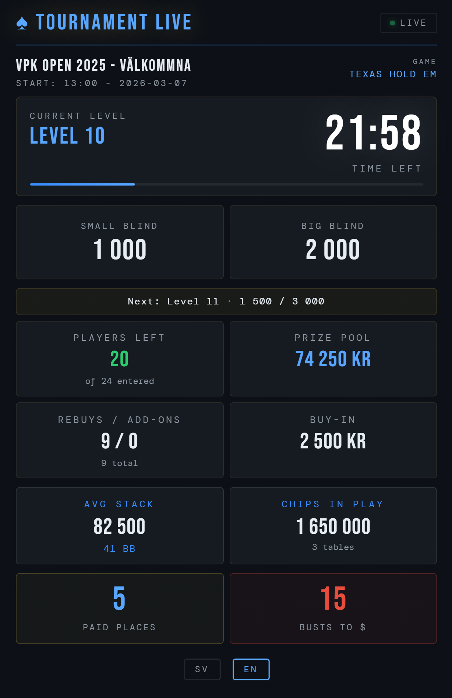

# ♠ Tournament Director Live

A real-time poker tournament display built for [The Tournament Director](https://www.thetournamentdirector.net/) software. Receives live updates via HTTP POST and displays them on a mobile-optimised dashboard hosted on Cloudflare Pages with data stored in Cloudflare KV.

**Live demo:** [live.vastanforspoker.org](https://live.vastanforspoker.org)



---

## ✨ Features

- ⏱ Live countdown clock that ticks locally between updates
- 🃏 Current & next blinds, ante, level info
- 👥 Players remaining, buy-ins, rebuys / add-ons
- 💰 Prize pool, house contribution, paid places
- 📊 Average stack in chips and BB, total chips in play
- 🌐 Swedish / English language toggle (saved in browser)
- 📡 Auto-detects lost connection after 5 minutes
- 🌙 GitHub Dark theme
- 📱 Mobile-first responsive design

---

## 🗂 File Structure

```
/
├── index.html               # Live display page (mobile-optimised)
├── wrangler.toml            # Cloudflare Pages config
├── functions/
│   └── td-receiver.js       # Cloudflare Pages Function (replaces td-receiver.php)
└── README.md
```

---

## 🚀 Setup Guide

### Prerequisites

- A [Cloudflare](https://cloudflare.com) account (free tier works)
- [The Tournament Director](https://www.thetournamentdirector.net/) software (Windows)
- A GitHub account
- A domain name added to Cloudflare (required to use a custom URL — a `*.pages.dev` subdomain works without one)

---

### Step 1 — Fork / Clone the repo

```bash
git clone https://github.com/YOUR_USERNAME/tournamentdirector-live.git
cd tournamentdirector-live
```

Or click **Fork** on GitHub to create your own copy.

---

### Step 2 — Create a Cloudflare KV Namespace

1. Log in to the [Cloudflare Dashboard](https://dash.cloudflare.com)
2. Go to **Workers & Pages → KV**
3. Click **Create namespace**
4. Name it anything, e.g. `TD_DATA`
5. Note the namespace — you'll bind it in the next step

---

### Step 3 — Deploy to Cloudflare Pages

1. Go to **Workers & Pages → Create application → Pages → Connect to Git**
2. Select your forked repo
3. Build settings:
   - **Framework preset:** None
   - **Build command:** *(leave empty)*
   - **Build output directory:** `/` *(or leave as default)*
4. Click **Save and Deploy**

---

### Step 4 — Bind the KV Namespace

1. Go to your Pages project → **Settings → Functions**
2. Scroll to **KV namespace bindings**
3. Click **Add binding**:
   - **Variable name:** `TD_DATA`
   - **KV namespace:** select the namespace you created
4. Click **Save**
5. Go to **Deployments** → click your latest deploy → **Retry deployment**

---

### Step 5 — Configure Tournament Director

1. Open **The Tournament Director**
2. Go to **Preferences → Status Updates**
3. Enable status updates and configure:
   - **URL:** `https://your-pages-domain.pages.dev/td-receiver`
   - **Method:** `POST`
   - **Format:** `JSON`
   - **Interval:** 90 seconds (recommended minimum)

> ⚠️ **Cloudflare KV free tier limits:** 100,000 reads/day · 1,000 writes/day · 1 GB storage · max 1 write/second per key. Exceeding these returns `429` errors. At 90-second intervals, Tournament Director performs ~240 writes per 6-hour session — well within limits. Each visitor tab adds ~240 reads per 6 hours. Shorter intervals increase both counts proportionally.

4. Click **OK**

> Replace `your-pages-domain` with your actual Cloudflare Pages domain or custom domain.

---

### Step 6 — Open the display

Navigate to your Pages URL (e.g. `https://your-domain.pages.dev`) on any device.  
Share the URL with players — it works on any phone or tablet browser.

---

## 🔍 Debug URLs

| URL | Description |
|-----|-------------|
| `/td-receiver` | Normal polling endpoint (used by `index.html`) |
| `/td-receiver?raw=1` | Pretty-printed raw JSON from TD |
| `/td-receiver?debug=1` | HTML table showing all fields + last received timestamp |

---

## ⚙️ Customisation

### Currency symbol
The default currency is `kr`. To change it, find this line in `index.html`:

```html
<input type="hidden" id="currencySymbol" value="kr">
```

Change `kr` to `$`, `€`, or whatever you need.

### Clock warning thresholds
```html
<input type="hidden" id="warnThreshold" value="120">   <!-- yellow at 2 min -->
<input type="hidden" id="critThreshold" value="30">    <!-- red at 30 sec -->
```

---

## 📋 TD JSON Fields Used

The following fields from Tournament Director's JSON output are used:

| Field | Description |
|-------|-------------|
| `Title` | Tournament name |
| `Description` | Tournament description |
| `GameName` | Game type (e.g. texas hold em) |
| `RoundNum` | Current round number |
| `Level` | Current level (including breaks) |
| `IsRound` / `IsBreak` | Whether current level is a round or break |
| `NextIsBreak` | Whether next level is a break |
| `SmallBlind` / `BigBlind` / `Ante` | Current blinds |
| `NextSmallBlind` / `NextBigBlind` | Next level blinds |
| `SecondsLeft` | Seconds remaining in level |
| `LevelDuration` | Level duration in **minutes** |
| `ClockPaused` | Whether the clock is paused |
| `PlayersLeft` | Players still in |
| `Buyins` | Total buy-ins sold |
| `TablesLeft` | Active tables |
| `Pot` | Total prize pool |
| `ChipCount` | Total chips in play |
| `DefaultBuyinFee` | Buy-in cost |
| `TotalRebuys` / `TotalAddons` | Rebuys and add-ons taken |
| `HouseContribution` | House contribution to prize pool |
| `InTheMoneyRank` | Number of paid places |
| `BustsUntilMoney` | Players that need to bust before money |
| `StateDesc` | Tournament state: `before`, `inprogress`, `after` |

---

## 📄 License

MIT — free to use and modify.

---

---

---


# ♠ Tournament Director Live — Svenska

Realtidsvisning för pokerturnering byggd för [The Tournament Director](https://www.thetournamentdirector.net/). Tar emot live-uppdateringar via HTTP POST och visar dem på en mobilanpassad dashboard hostad på Cloudflare Pages med data lagrat i Cloudflare KV.

---

## ✨ Funktioner

- ⏱ Live nedräkningsklocka som tickar lokalt mellan uppdateringar
- 🃏 Aktuella & nästa blinds, ante, nivåinfo
- 👥 Spelare kvar, inköp, rebuys / add-ons
- 💰 Prispott, husbidrag, betalda platser
- 📊 Snittstack i marker och BB, totalt marker i spel
- 🌐 Svenska / engelska språkval (sparas i webbläsaren)
- 📡 Upptäcker automatiskt tappat anslutning efter 5 minuter
- 🌙 GitHub Dark-tema
- 📱 Mobilanpassad design

---

## 🗂 Filstruktur

```
/
├── index.html               # Live-visningssida (mobilanpassad)
├── wrangler.toml            # Cloudflare Pages-konfiguration
├── functions/
│   └── td-receiver.js       # Cloudflare Pages Function (ersätter td-receiver.php)
└── README.md
```

---

## 🚀 Installationsguide

### Förutsättningar

- Ett [Cloudflare](https://cloudflare.com)-konto (gratistjänst fungerar)
- [The Tournament Director](https://www.thetournamentdirector.net/) (Windows)
- Ett GitHub-konto
- Ett domännamn kopplat till Cloudflare (krävs för egen URL — en `*.pages.dev`-subdomän fungerar utan)

---

### Steg 1 — Forka / klona repot

```bash
git clone https://github.com/DITT_ANVÄNDARNAMN/tournamentdirector-live.git
cd tournamentdirector-live
```

Eller klicka **Fork** på GitHub för att skapa din egen kopia.

---

### Steg 2 — Skapa ett Cloudflare KV Namespace

1. Logga in på [Cloudflare Dashboard](https://dash.cloudflare.com)
2. Gå till **Workers & Pages → KV**
3. Klicka **Create namespace**
4. Namnge det valfritt, t.ex. `TD_DATA`
5. Notera namespacet — du kopplar det i nästa steg

---

### Steg 3 — Deploya till Cloudflare Pages

1. Gå till **Workers & Pages → Create application → Pages → Connect to Git**
2. Välj ditt forkade repo
3. Build-inställningar:
   - **Framework preset:** None
   - **Build command:** *(lämna tomt)*
   - **Build output directory:** `/` *(eller lämna som standard)*
4. Klicka **Save and Deploy**

---

### Steg 4 — Koppla KV Namespace

1. Gå till ditt Pages-projekt → **Settings → Functions**
2. Scrolla ned till **KV namespace bindings**
3. Klicka **Add binding**:
   - **Variable name:** `TD_DATA`
   - **KV namespace:** välj det namespace du skapade
4. Klicka **Save**
5. Gå till **Deployments** → klicka på senaste deployen → **Retry deployment**

---

### Steg 5 — Konfigurera Tournament Director

1. Öppna **The Tournament Director**
2. Gå till **Preferences → Status Updates**
3. Aktivera statusuppdateringar och ange:
   - **URL:** `https://din-pages-domän.pages.dev/td-receiver`
   - **Method:** `POST`
   - **Format:** `JSON`
   - **Interval:** 90 sekunder (rekommenderat minimum)

> ⚠️ **Cloudflare KV gratistjänst:** 100 000 läsningar/dag · 1 000 skrivningar/dag · 1 GB lagring · max 1 skrivning/sekund per nyckel. Om gränserna överskrids returneras `429`-fel. Med 90 sekunders intervall gör Tournament Director ~240 skrivningar per 6-timmars spel — långt under gränsen. Varje öppen visningsflik lägger till ~240 läsningar per 6 timmar. Kortare intervall ökar båda proportionellt.

4. Klicka **OK**

> Ersätt `din-pages-domän` med din faktiska Cloudflare Pages-domän eller anpassad domän.

---

### Steg 6 — Öppna visningen

Gå till din Pages-URL (t.ex. `https://din-domän.pages.dev`) på valfri enhet.  
Dela länken med spelarna — fungerar i alla mobil- och surfplattewebbläsare.

---

## 🔍 Debug-URLs

| URL | Beskrivning |
|-----|-------------|
| `/td-receiver` | Normal polling-endpoint (används av `index.html`) |
| `/td-receiver?raw=1` | Pretty-printad rå JSON från TD |
| `/td-receiver?debug=1` | HTML-tabell med alla fält + tidsstämpel för senaste mottagning |

---

## ⚙️ Anpassning

### Valutasymbol
Standard är `kr`. Ändra i `index.html`:

```html
<input type="hidden" id="currencySymbol" value="kr">
```

### Klockvarningar
```html
<input type="hidden" id="warnThreshold" value="120">   <!-- gul vid 2 min -->
<input type="hidden" id="critThreshold" value="30">    <!-- röd vid 30 sek -->
```

---

## 📄 Licens

MIT — fri att använda och modifiera.

---

© 2026 McFrojd Softwares